# Green List 
Green list app for an assignment ST # 5.
- GreenFootprint Technologies.
- Green List is developing a mobile app to encourage sustainable living and track users' friendly activities.
The app will feature tools to measure environmental impact, discover green lists, and join community initiatives.
# Features
- Note everything you want with the images and displaying for everyone.
- Notes are saved via Firebase firestore, realtime database.
- Login via Email Account
# Run
- To run this project first, create firebase auth, firestore, database then connect them with [firebase](https://console.firebase.google.com)
- Run gradle options, sync and run project.
  
## Logo

  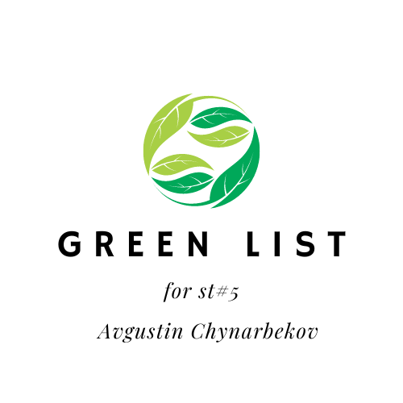
  

  
# Screens

  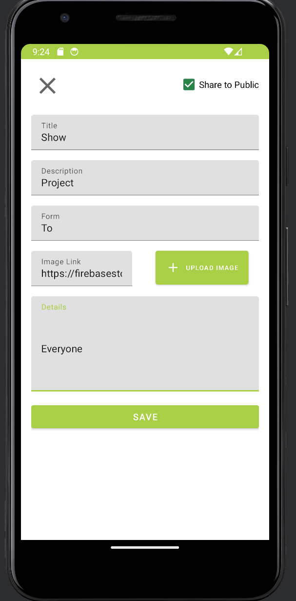
  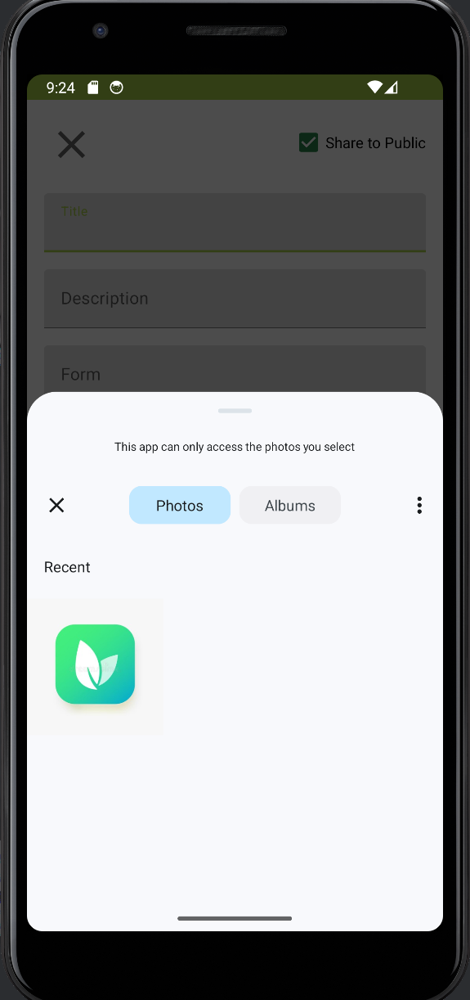
  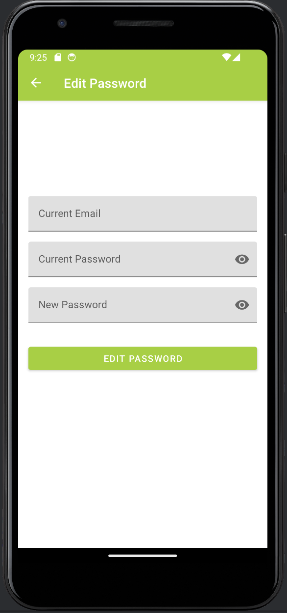
  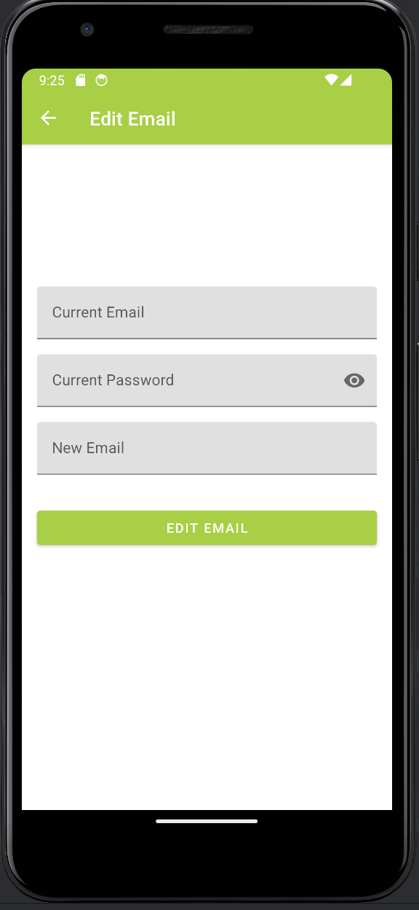
  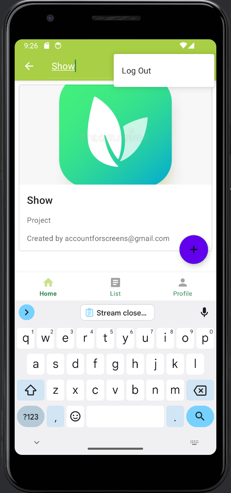
  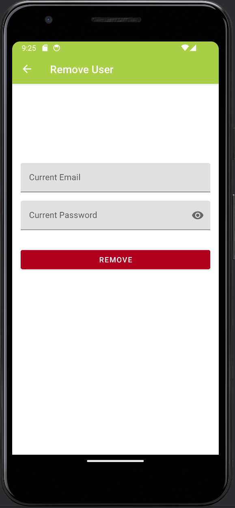
  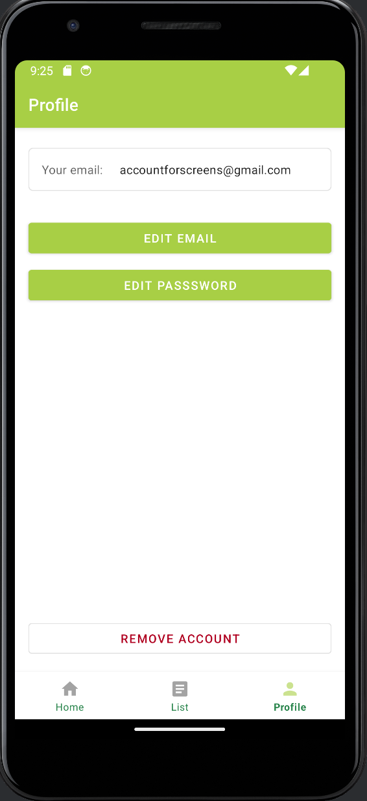
  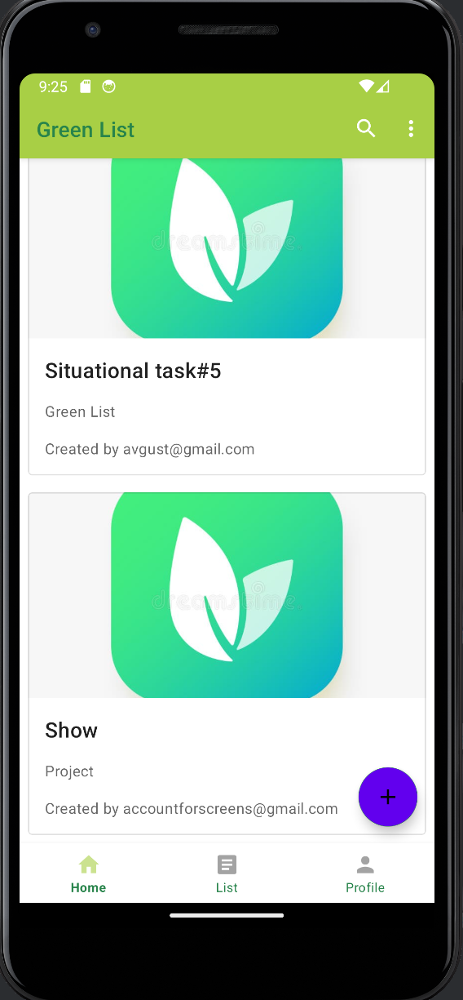
  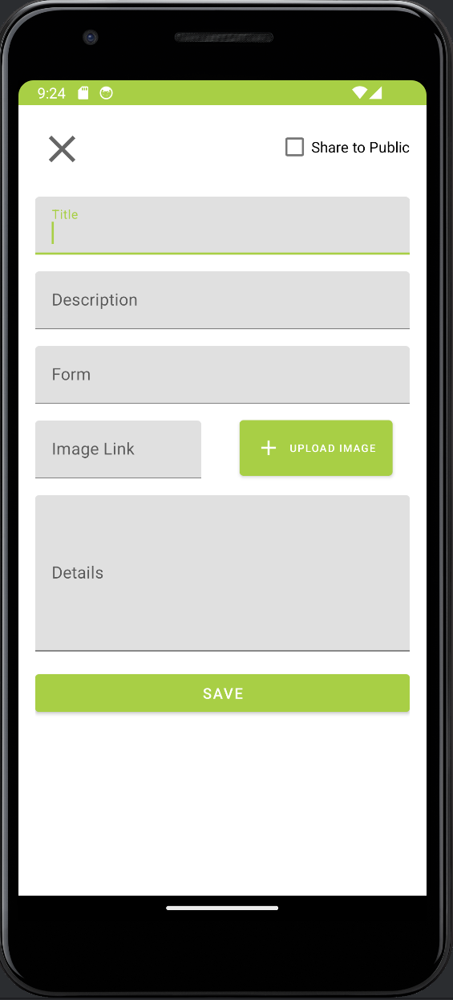
  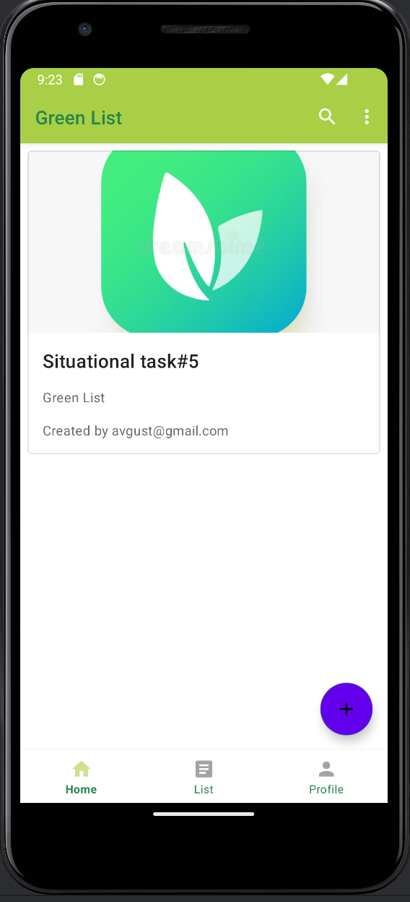
  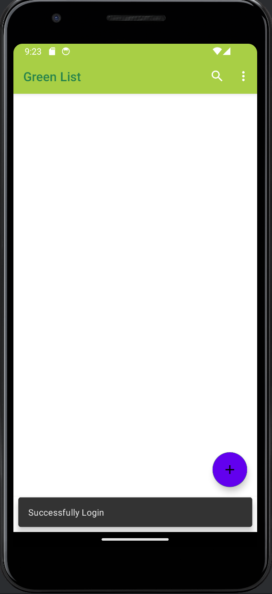
  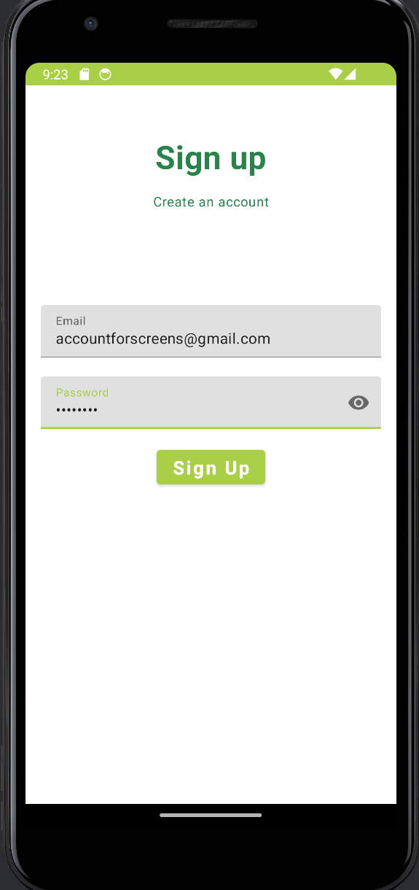
  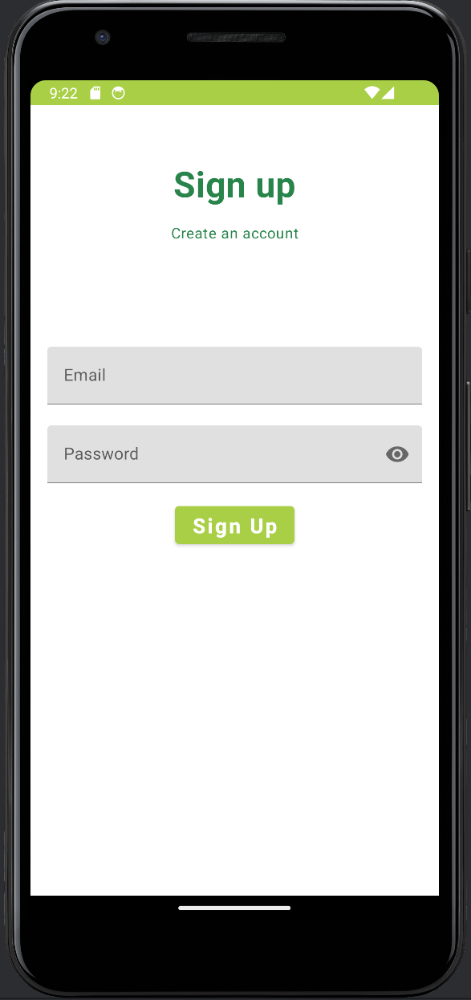
  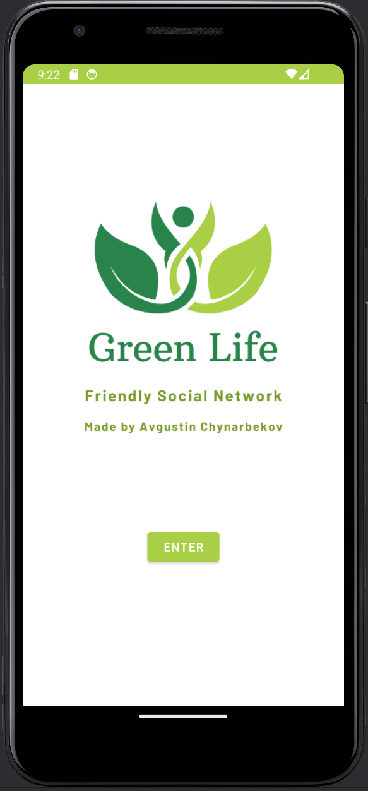
  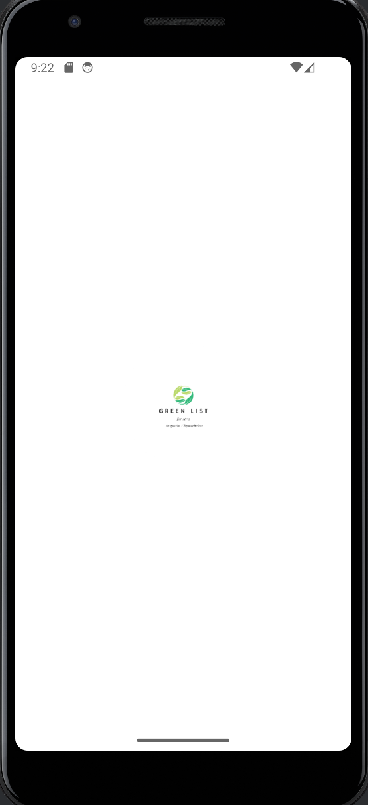
  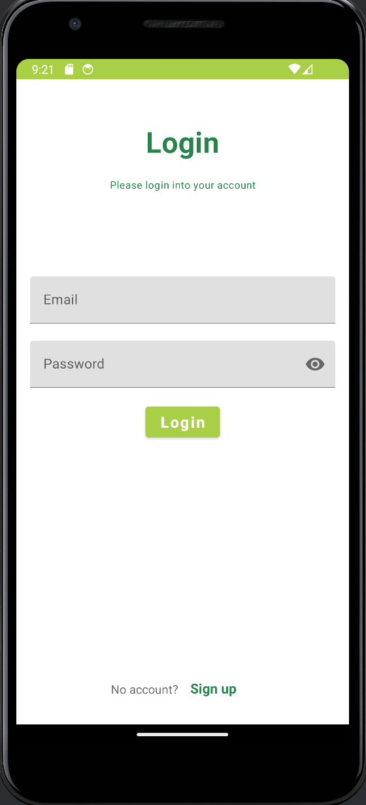

  

# Firebase data

  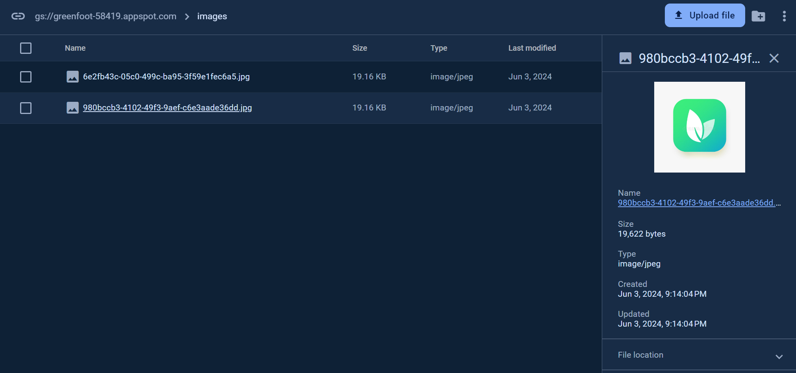
  
  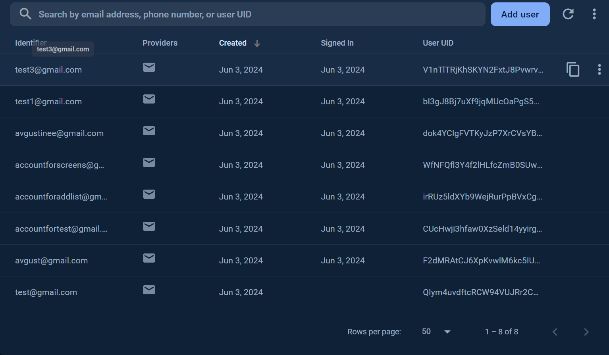
  

  
# Tools

- Firebase
- Firestore
- Firebase database
- Kotlin
- MVVM
- Database
  

# Video

https://github.com/NPaugust/greenlist/assets/72886935/eebdbcf2-c8cd-4f68-8421-55ab334608cc

## Google Drive Video
[Video Record](https://drive.google.com/drive/u/0/folders/1C_EQgyPnndY-jW87Go49djX_aAzTi_8r)

## Credit
[Avgustine](https://github.com/NPaugust)
